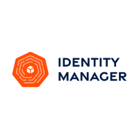

<!--  -->

 

# Identity Manager

Identity Manager is a Kubernetes operator that helps you manage roles or identities for the cloud inside your Kubernetes cluster. It maintains full life cycle of the identities. See [Introduction](https://invisibl-cloud.github.io/identity-manager-docs/) for more information and documentation.

## Documentation

Identity Manager Operator guides, quick start, troubleshooting and reference documentation is available at [Identity Manager Docs](https://invisibl-cloud.github.io/identity-manager-docs).

## Supported Cloud Platforms

## Contributing

We welcome and encourage contributions to this project! Please read the [Developer](https://invisibl-cloud.github.io/identity-manager-docs/developer-guide/) and [Contribution process](https://invisibl-cloud.github.io/identity-manager-docs/contributing-process/) guides. Also make sure to check the [Code of Conduct](https://invisibl-cloud.github.io/identity-manager-docs/contributing-coc/) and adhere to its guidelines.

## License

[Apache License 2.0](./LICENSE)

## Kicked off by

