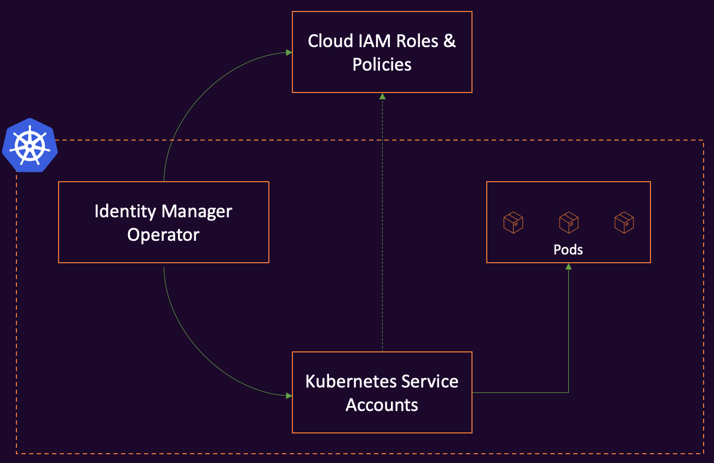

# Overview

## Architecture


The Identity Manager Operator extends Kubernetes with Custom Resources to provide necessary Service Accounts along with required IAM Roles & Policies for pods to connect with Cloud APIs. The controller creates the defined policies in the cloud and maps them to the defined service account. If the desired state is changed, the controller will reconcile the state in the cluster and in the cloud. The supported cloud platforms are AWS and Azure.


## WorkloadIdentity

The WorkloadIdentity resource defines the cloud provider, and the cloud provider's spec. The cloud provider defines the cloud platform for which the policies have to be created. Currently supported cloud providers are AWS and Azure. The Role policies define the policies that the pods require to access to appropriate cloud APIs. The service account defines the service account which is mapped to the defined policies. The WorkloadIdentity resource is namespaced.

The working of Identity Manager is possible with an AWS's feature called IRSA.

## IRSA - IAM Roles for Service Accounts

IRSA works by associating an IAM role to a service account. This service account can then provide AWS permissions to the containers in any pod that uses that service account. With this feature, there is no need to extend the IAM permissions to the EKS node's IAM role. 

With IRSA, the pods are made the first class citizens in IAM. Instead of intercepting the requests to the EC2 metadata API to perform a call to the STS API to retrieve temporary credentials, the changes are made in the AWS identity APIs to recognize Kubernetes pods. By combining an OpenID Connect (OIDC) identity provider and Kubernetes service account annotations, the users can use the IAM roles at the pod level.

For more information, refer [AWS IRSA](https://aws.amazon.com/blogs/opensource/introducing-fine-grained-iam-roles-service-accounts/)

## Behavior
This section defines the behavior of the Identity Manager in AWS EKS cluster for the following sample workload identity.
``` yaml
--8<-- "examples/demo-workload-identity.yaml"
```
On applying the above workload identity, Identity Manager Operator reconciles the workload identity in the following manner:

1. The Identity Manager identifies the cloud provider using `spec.provider`. This also tells the Identity Manager to read the AWS specific spec at `spec.aws`.
2. The Identity Manager uses specified credentials in `spec.credentials` to instantiate the cloud provider's API client if the cluster is a non EKS cluster.
3. The Identity Manager creates an IAM role with the name `demo-identity`, in the path mentioned in `spec.aws.path` attaches the policies defined in `spec.aws.inlinePolicies`, applies the trust policy specified in `spec.aws.assumeRolePolicy` to the IAM role. The created IAM role will have the session duration mentioned in `spec.aws.maxSessionDuration`. It is the user's responsibility to populate the OIDC provider, namespace and the service account to which the IAM role will be annotated in `spec.aws.assumeRolePolicy`.
4. The Identity Manager creates or updates the service account depending on the service account action specified in the `spec.aws.serviceAccounts.action`. The service account creates a new annotation with the newly created IAM role in the service account if the `spec.aws.serviceAccounts.action` is `Create`. If `spec.aws.serviceAccounts.action` is `Update`, the Identity Manager will update the service account's annotation if necessary. The following shows the example annotation of a service account:
```
 annotations:
    eks.amazonaws.com/role-arn: arn:aws:iam::123248189203:role/demo-identity
```
5. Identity manager will use pods.matchLables to verify whether the role is assigned to a pod and it will restart the pods if it is not assigned.
6. The roles and policies and deleted if the workload identity is deleted.

## Access Control

The Identity Manager Operator runs as a deployment in your cluster with elevated
privileges. It will read secrets in all namespaces. Ensure that the credentials you provide give Identity Manager the least privilege necessary.